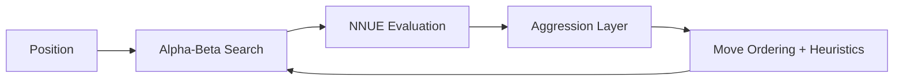
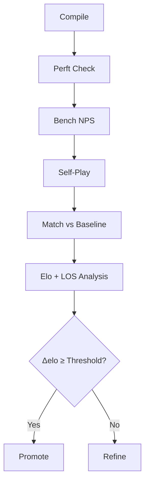

<div align="center">


# Solace

**An NNUE-powered, ultra-aggressive UCI chess engine built on the architecture of Stockfish. Structured aggression meets measurable strength.**

---

<p>


</p>
</div>

---

## Overview

Solace is a **deterministic, NNUE-enhanced UCI chess engine** engineered for controlled, statistical aggression.

It extends the proven search and evaluation framework of Stockfish while introducing measurable attacking bias through:

* **Evaluation optimism under imbalance**
* **Search-depth bonuses for king pressure**
* **Optional aggression-trained NNUE networks**
* **Per-search aggression instrumentation**

At default settings, Solace is **bit-for-bit identical** to upstream Stockfish.

---

## Core Philosophy

Solace does not play randomly aggressive chess.

It implements:

* **Quantified Sacrifice Modeling** — Sacrifices must statistically justify long-term compensation.
* **King-Proximity Search Bias** — Tactical pressure near the enemy king receives deeper exploration.
* **Draw Resistance Control** — Reduced early simplification bias in dynamically rich positions.
* **Deterministic Behavior** — No stochastic style injection. Every result is reproducible.

Aggression is parameterized, measurable, and reversible.

---

## Feature Set

* **Full UCI Compatibility**
* **Parametric Aggression Mode (0–100 intensity)**
* **Custom Aggression-Trained NNUE Support**
* **Search Heuristic Modifications (LMR + Capture History Bias)**
* **Structured Telemetry (`solace_aggr` stats output)**
* **Benchmark + Elo Validation Pipeline**
* **GPLv3 Open Source**

---

## Quick Start

### Clone & Build

```bash
git clone https://github.com/Zorvia/Solace.git
cd Solace/src

# AVX2 recommended
EXTRACXXFLAGS="-DNNUE_EMBEDDING_OFF" make ARCH=x86-64-avx2 EXE=solace -j$(nproc)
```

### Run

```bash
./solace
uci
```

Expected:

```text
id name Solace
uciok
```

Use any UCI-compatible GUI.

---

## Aggression Controls (UCI)

| Option                  | Type       | Default | Description               |
| ----------------------- | ---------- | ------- | ------------------------- |
| `SolaceAggressionMode`  | combo      | Off     | Off / Param / NNUE        |
| `SolaceAggressionLevel` | spin 0–100 | 0       | Intensity when mode=Param |
| `SolaceAggressionNet`   | string     | empty   | Custom `.nnue` file       |

### Example: Structured Aggression

```
setoption name SolaceAggressionMode value Param
setoption name SolaceAggressionLevel value 75
```

### Example: Aggression-Trained Network

```
setoption name EvalFile value /path/to/base.nnue
setoption name SolaceAggressionMode value NNUE
setoption name SolaceAggressionNet value /path/to/nn-solace.nnue
```

---

## Engine Architecture



Search remains classical alpha-beta with pruning.
Aggression influences evaluation scaling and move prioritization.

---

## Telemetry & Instrumentation

When aggression is enabled, Solace emits structured metrics:

```
info string solace_aggr total_moves 18420 sacrifices 312 sac_per_1k 16 \
  king_attacks 1104 king_per_1k 59 draw_vicinity 420 aggr_level 75
```

Metrics include:

* Sacrifices per 1000 moves
* King attack frequency
* Draw proximity weighting
* Active aggression level

This allows controlled experimentation and regression tracking.

---

## Training Pipeline

Solace supports training custom aggression-specialized networks.

### Dataset Source

Aggressive games filtered from high-level online databases
(Gambits, Sicilian Dragon, King’s Indian structures, etc.)

### Training

* FEN extraction with outcome labels
* Imbalance-weighted loss function
* Pure NumPy training loop (CPU-compatible)
* Export to fully valid `.nnue` binary
* Compatible with nnue-pytorch for GPU-scale runs

All outputs are hash-verified and Stockfish-compatible.

---

## Validation Pipeline



Every modification is:

* Perft validated
* Bench validated
* Elo tested
* Statistically gated

No regression is merged without passing strength criteria.

---

## Project Structure

```
Solace/
├── assets/                 # Logos and visual assets
├── src/                    # Engine source
├── scripts/                # Training, benchmarking, Elo tools
├── data/                   # Training datasets
├── checkpoints/            # NNUE checkpoints
├── logs/                   # Benchmark logs
├── match_results/          # Elo match output
├── Makefile
└── README.md
```

---

## Baseline Guarantee

With:

```
setoption name SolaceAggressionMode value Off
```

Solace produces **identical behavior** to the upstream version of Stockfish it was forked from.

No hidden heuristics. No strength regression at default.

---

## License

GPLv3 — inherits from Stockfish.

See `COPYING`.

---
