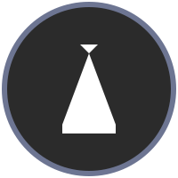
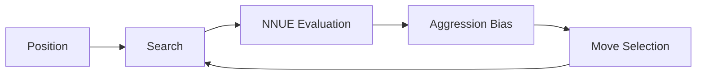
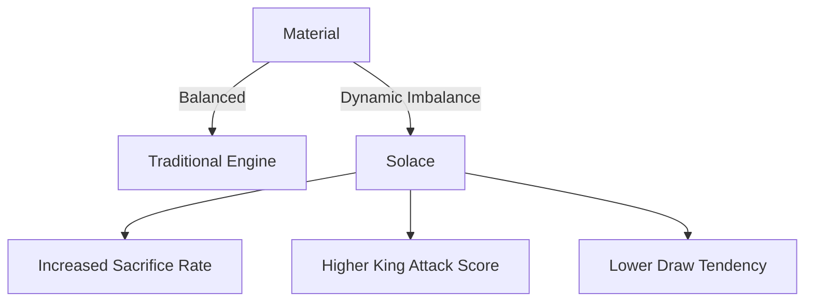
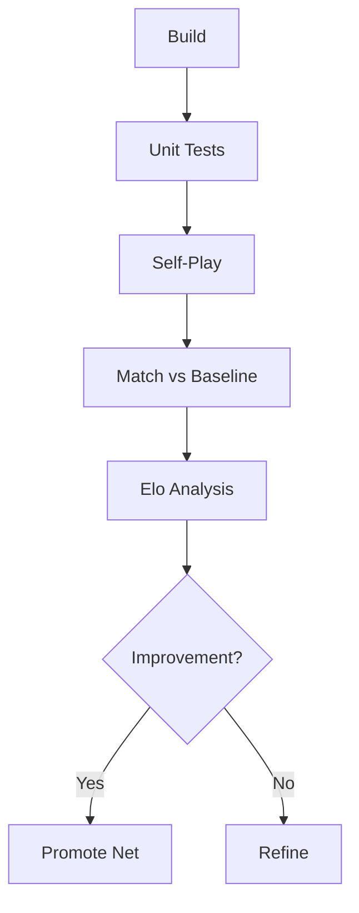

<div align="center">



# Solace

**An NNUE-powered, ultra-aggressive UCI chess engine built on Stockfish architecture. Structured aggression meets measurable strength.**

---

<p>


</p>
</div>

---

## Overview

Solace is a **deterministic, NNUE-powered UCI chess engine** designed for:

- **Aggressive Initiative:** Prefers dynamic imbalance and king pressure over static material.  
- **Structured Sacrifices:** Evaluates risk vs. compensation statistically.  
- **Performance & Accuracy:** Deterministic search, fully benchmarked, optimized in C++.

Solace is ideal for players and researchers exploring stylistic engine bias and neural evaluation tuning.

---

## Features

- **NNUE Evaluation:** Neural-network-driven position scoring.  
- **Dynamic Imbalance Handling:** Sacrifices and attacks calculated for maximum effectiveness.  
- **UCI-Compatible:** Works with any UCI-compliant GUI.  
- **Open Source (GPLv3):** Full source code, auditable and modifiable.  
- **Deterministic & Benchmarkable:** Reproducible search results.  
- **High Performance:** Optimized for speed and efficiency in C++.

---

## Quick Start

### Clone & Build

```bash
git clone https://github.com/Zorvia/Solace.git
cd Solace/src
make -j profile-build
````

### Run

```bash
./solace
uci
```

Expected output:

```text
id name Solace
uciok
```

> Solace has no built-in GUI; use any UCI-compatible interface.

---

## Architecture



* Evaluates positions prioritizing **initiative, king pressure, mobility, space, and long-term compensation**.
* Aggression is calculated and statistical, not random.

---

## Aggression Model



* Aggression is balanced with measurable statistical results.
* Sacrifices are executed only when pressure outweighs material.

---

## Validation Pipeline



* Each update is compiled, stress-tested, and evaluated through Elo self-play.
* Strength and aggression are validated, ensuring reliability.

---

## Project Structure

```
Solace/
├── assets/          # Logos, images, SVGs
├── src/             # Engine source code
├── tests/           # Unit tests and validation scripts
├── examples/        # Sample configuration and run scripts
├── docs/            # Documentation
├── Makefile
└── README.md
```

---

## Contributing

* Follow [CONTRIBUTING.md](CONTRIBUTING.md).
* Clear, readable commits and educational clarity are prioritized.
* All contributions welcome.

---

## License

**GPLv3** — See [LICENSE](LICENSE) for full terms.

---

## Version

**v1.0.0** (Alpha) — Fully functional but may contain minor issues.

**© 2025-2026 Zorvia. All Rights Reserved.**


Do you want me to do that next?
```
